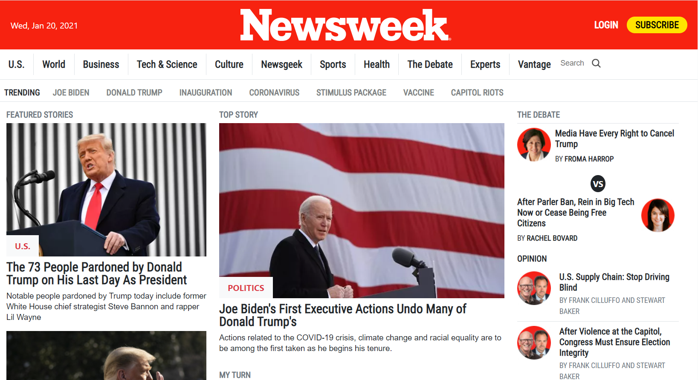

# Project 3: Using bootstrap

> This project consists of cloning [this web site](https://web.archive.org/web/20210120125445/https://www.newsweek.com/) using mostly bootstrap classes.

## Built With

- Bootstrap
- HTML
- CSS

## Live Demo

[Live Demo Link](https://george-swift.github.io/project-three-using-bootstrap/)

## Authors

👤 **Ubong George**

- GitHub: [@george-swift](https://github.com/george-swift)

👤 **Jose L. Lozano**

- GitHub: [@kuawi](https://github.com/kuawi)

## 🤝 Contributing

Contributions, issues, and feature requests are welcome!

## Show your support

Give a ⭐️ if you like this project!

## Acknowledgments

- Hat tip to newsweek website for its images.
